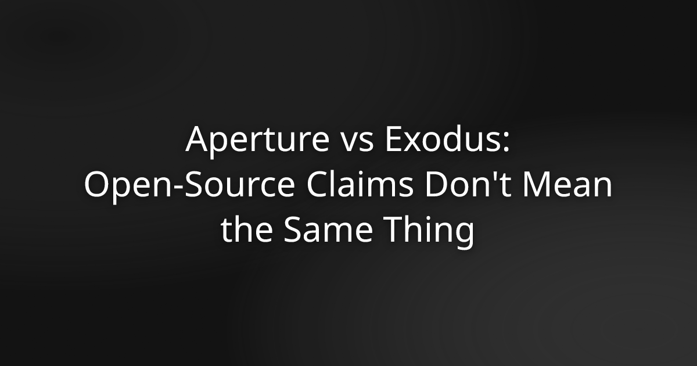

# Aperture vs Exodus: Open-Source Claims Don't Mean the Same Thing

Exodus markets itself as a self-custody wallet and uses the phrase "open-source" in its documentation. If you're evaluating it as a place to store real money, both of those claims deserve a closer look — because neither means what you might assume.

This comparison is for people who have already decided they want self-custody and are now asking which wallet actually delivers it.

---

## What Exodus Gets Right

Exodus is non-custodial in the basic sense: it generates a private key on your device and doesn't hold it on a server. Your recovery phrase belongs to you. No exchange controls your funds.

That matters. It puts Exodus ahead of custodial products like a standard exchange account.

But non-custodial is the floor, not the ceiling. The more precise questions are: where exactly is the key stored on your device, and can you verify the code that handles it?

---

## The Open-Source Gap

Exodus describes parts of its codebase as open-source. The accurate description is partially open-source. Core wallet logic — including the code that handles key generation and storage — isn't publicly available for review.

That's a meaningful distinction. "Open-source" without a reproducible build means you can read some of the code but can't verify that the binary you downloaded matches any of it. The published source and the running app could differ in ways you have no way to detect.

Aperture's entire codebase is public at [devdasx/aperture](https://github.com/devdasx/aperture) on GitHub. The released binary matches the published source code byte-for-byte. Anyone with the standard toolchain can reproduce the build independently and confirm the match. That's what a reproducible build means in practice — it's a verifiable property, not a marketing claim.

If you audit repos before downloading a wallet, the gap between these two positions is not minor.

---

## Where the Keys Actually Live

On iOS, there are two places a wallet can store private key material: the standard iOS Keychain and the Secure Enclave.

The Secure Enclave is a physically isolated hardware security module built into every modern iPhone — the same chip that protects your Face ID biometrics and Apple Pay credentials. Key material stored there can't be extracted by software, even if the operating system is compromised. It never leaves the chip.

The iOS Keychain is software-level encrypted storage. Meaningfully secure under normal conditions, but without the same hardware isolation guarantee. Key material in the Keychain can, in principle, be accessed by a compromised OS or a malicious process with sufficient privileges.

Exodus stores keys in the standard iOS Keychain. It does not use the Secure Enclave.

Aperture generates and stores private keys in the Secure Enclave. The keys are never transmitted anywhere. The app makes zero server calls — there's no backend infrastructure that could be breached or subpoenaed, because none exists.

The practical gap: with Aperture, your key material sits in hardware-isolated storage with the same security properties as your Face ID data. With Exodus, it sits in software-encrypted storage that a sufficiently capable attacker could reach.

---

## Network Coverage

Exodus supports a wide range of assets. For most users evaluating it against a Bitcoin-and-Ethereum workflow, coverage isn't the limiting factor.

Aperture covers 24 networks from a single interface: Bitcoin, Bitcoin Cash, Litecoin, Dogecoin, Ethereum, Arbitrum, Base, Optimism, Scroll, zkSync, Polygon, BNB, opBNB, Avalanche, Celo, Aptos, NEAR, Polkadot, XRP, Solana, Stellar, Sui, TON, and Tron. All of it runs through the same Secure Enclave key storage with no account required.

For multi-chain users, the relevant question isn't just which networks are supported — it's whether the security model holds consistently across all of them. With Aperture, it does.

---

## The Cost of Swaps

Exodus generates revenue partly through in-app swaps, with spreads starting at approximately 0.5 percent. That's not hidden, but it's a cost you absorb on every exchange inside the app.

Aperture has no swap spreads, no subscription, and no premium tier. There's nothing to pay.

---

## Side-by-Side Summary

| | Aperture | Exodus |
|---|---|---|
| Key storage | Secure Enclave | iOS Keychain |
| Open-source | Fully open-source, reproducible build | Partially open-source, no reproducible build |
| Server calls | Zero | Standard app infrastructure |
| Networks | 24 | Multi-chain |
| Swap fees | None | ~0.5% spread |
| Account required | No | No |
| Cost | Free | Free (swap revenue model) |

---

## What "Verifiable" Actually Means

The reproducible build is worth dwelling on. It's the mechanism that makes an open-source claim meaningful rather than decorative.

When Aperture publishes a release, anyone can take the published source, build it with the documented toolchain, and confirm that the resulting binary is identical to the one on the App Store. This closes the gap between "the code looks fine" and "the app I'm running is the code I reviewed."

Exodus can't offer this. You can read the portions of its code that are public, but you can't verify that the binary you installed matches them. The trust gap stays open.

For a security-critical application like a crypto wallet, that gap is exactly where risk lives.

---

## The Correct Question

When comparing wallets, "is this non-custodial?" is the wrong place to stop. Most serious wallets are. The questions that actually matter are:

Where is the key material stored, and what hardware protects it? Can I verify that the code handling my keys is the code actually running? Does the app make any server calls that could expose data or create a point of failure?

Aperture answers all three in a way that's verifiable, not asserted. Exodus does not.

If you want a wallet where the security architecture is auditable end-to-end and key material sits in hardware-isolated storage, Aperture is available free on the App Store at [aperturex.io](https://aperturex.io/). No sign-up required. Read the code on GitHub first if you prefer — that's the point.

---

## Frequently Asked Questions

**Is Exodus a safe wallet?**
Exodus is non-custodial, meaning it doesn't hold your keys on a server. That said, it stores key material in the standard iOS Keychain rather than the Secure Enclave, and its core codebase isn't fully open-source. It's a reasonable wallet for casual use, but it doesn't offer hardware-level key isolation or a verifiable build.

**What is the difference between the Secure Enclave and the iOS Keychain?**
The Secure Enclave is a physically isolated hardware security module inside every modern iPhone. Key material stored there can't be extracted by software, even under OS compromise. The iOS Keychain is software-encrypted storage — meaningfully secure under normal conditions, but without the same hardware isolation guarantee.

**Does Aperture support the same blockchains as Exodus?**
Aperture covers 24 networks including Bitcoin, Ethereum, Solana, Polkadot, XRP, and most major L2s. For the networks most users actively hold, coverage is comparable. Every network in Aperture uses the same Secure Enclave key storage.

**What does a reproducible build mean for a crypto wallet?**
A reproducible build means the released binary can be independently rebuilt from the published source code and confirmed to match byte-for-byte. It proves that the app running on your phone is the code that was reviewed — not a modified version. Aperture supports this. Exodus does not.

**Is Aperture free to use?**
Yes. No subscription, no premium tier, no swap spreads, no sign-up required. Free on the App Store.

**Can Aperture recover my funds if I lose my recovery phrase?**
No. Aperture is fully self-custody. Your recovery phrase is shown once, on-device, to you only — never transmitted or stored externally. If you lose it, access to your funds is lost. That's the correct behavior for a self-custody wallet.

**Why does it matter that Aperture makes zero server calls?**
A server call creates a point of failure: a server can be breached, compelled by legal process, or shut down. Aperture's architecture is fully client-side with no backend infrastructure. There's nothing to breach or subpoena because nothing exists on a server.
