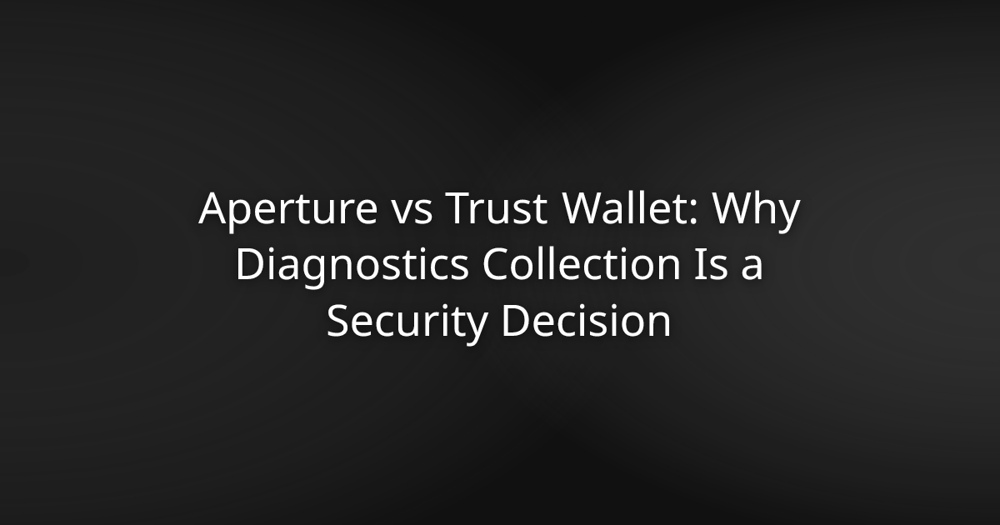

# Aperture vs Trust Wallet: Why Diagnostics Collection Is a Security Decision

Most wallet comparisons get stuck on supported chains or interface design. Those things matter, but they sit downstream of a more fundamental question: what does the app actually do with your device, your data, and your keys when you're not actively watching?

Trust Wallet and Aperture both describe themselves as non-custodial. The difference between them isn't a matter of preference. It's a matter of architecture.

---

## What "Non-Custodial" Actually Requires

Non-custodial means no third party holds your private keys. That's the baseline. But the term has been stretched to cover wallets that collect diagnostic data, make server calls, store keys in standard OS keystores, and ship closed-source binaries you cannot independently verify.

Each of those practices introduces a trust assumption. You're not handing a custodian your funds directly, but you are trusting that the app behaves exactly as described — that the servers it contacts aren't logging anything sensitive, and that the closed binary matches what the developers claim it does.

That's a significant amount of trust for a tool whose entire purpose is to eliminate it.

---

## Trust Wallet's Architecture: What You're Actually Accepting

Trust Wallet supports over 100 blockchains. On iOS, it stores private keys in the standard iOS Keychain. The Keychain is encrypted and reasonably secure for general app data — but it is not the Secure Enclave. The Secure Enclave is a physically isolated hardware security module inside Apple silicon, the same one that protects Face ID biometrics and Apple Pay credentials. Keys stored there cannot be extracted by software, even if the main processor is compromised.

Keys in the standard Keychain don't carry that guarantee. They're accessible to the application process, which means any vulnerability in the app's code — or in a dependency it pulls in — could potentially expose them.

Trust Wallet's codebase is also closed-source. You can't read the code, verify the build, or confirm that the binary you downloaded from the App Store corresponds to any published source. You're taking the developers at their word.

### The Diagnostics Question

Trust Wallet collects diagnostics and usage data. The specific data points vary by version and platform, but the category itself is what matters: any telemetry pipeline is a surface. Data leaves your device, travels to servers, and those servers can be breached, subpoenaed, or acquired.

The standard counterargument is that diagnostics don't include key material. That's probably true. But diagnostics can include behavioral patterns, device identifiers, network activity, and error states that reveal information about your wallet activity. More to the point, the existence of server-side infrastructure means there's a backend that could be compelled to produce records.

For most apps, that's an acceptable trade-off. For a wallet holding your crypto, it's a design decision worth examining carefully.

---

## Aperture's Architecture: What the Code Shows

[Aperture](https://aperturex.io/) makes zero server calls. The architecture is fully client-side. There is no backend to breach, subpoena, or acquire — because there is no backend.

Private keys are generated on your device and stored in Apple's Secure Enclave. They never leave it. Not during setup, not during signing, not ever. The app requires no account and collects no user data. There's nothing to collect because there's no mechanism to transmit anything.

The recovery phrase is shown once, on-device, to you only. It isn't stored externally or sent anywhere.

Every action requires Face ID. On-device encryption applies throughout.

### The Reproducible Build: Proof, Not a Claim

The full codebase is public at [devdasx/aperture](https://github.com/devdasx/aperture) on GitHub. That's table stakes for any wallet asking for your trust. What goes further is the reproducible build: the binary on the App Store matches the published source code byte-for-byte. Anyone with the right tools can verify this independently. The match isn't asserted — it's checkable.

This matters because closed-source wallets can publish detailed security copy without any mechanism for outside verification. A reproducible build removes that ambiguity. Either the binary matches the source or it doesn't. No one's word required.

A public bug bounty program at [aperturex.io/bug-bounty](https://aperturex.io/bug-bounty) keeps community security review ongoing. Researchers can read the code, find issues, and report them. That's how security improves in the open.

---

## Side-by-Side Comparison

| | Aperture | Trust Wallet |
|---|---|---|
| Key storage | Secure Enclave | Standard iOS Keychain |
| Server calls | Zero | Yes (telemetry, diagnostics) |
| Source code | Fully open-source | Closed-source |
| Reproducible build | Yes, byte-for-byte verifiable | No |
| Account required | No | No |
| Data collection | None | Diagnostics and usage data |
| Bug bounty | Public | Not publicly documented |
| Networks supported | 24 | 100+ |
| Cost | Free | Free |

Network count is the one area where Trust Wallet has a wider surface. If you need a chain Aperture doesn't currently support, that's a real constraint. But across the 24 networks it does cover — Bitcoin, Ethereum, Solana, Polkadot, Arbitrum, Base, Tron, and others — you get hardware-equivalent key security with a fully auditable codebase, at no cost.

---

## Why This Is a Security Decision, Not a Features Decision

Diagnostics collection isn't a trivial setting. It's an architectural choice that tells you something about how a wallet was designed and whose interests the design serves.

A wallet built for genuine self-custody minimizes its attack surface. It doesn't make server calls it doesn't need. It doesn't collect data it doesn't use. It doesn't store keys somewhere accessible to the application layer when a more isolated option exists.

When a wallet makes different choices, the question isn't whether the developers are trustworthy. The question is whether the architecture requires you to trust them at all. Good security design removes that requirement.

Aperture is built so you don't have to trust it. You can verify it. That's the correct design for a self-custody wallet.

If you're evaluating a Trust Wallet alternative for iPhone and your criteria include key isolation, zero data collection, and an auditable codebase, the architecture described here is what you're looking for. Read the code at devdasx/aperture, and download Aperture free from the App Store at [aperturex.io](https://aperturex.io/) — no sign-up required.

---

## Frequently Asked Questions

**Does Trust Wallet store private keys in the Secure Enclave on iOS?**
No. Trust Wallet stores keys in the standard iOS Keychain. The Secure Enclave is a physically isolated hardware security module that prevents key extraction even if the main processor is compromised. The standard Keychain does not provide that isolation.

**What data does Trust Wallet collect?**
Trust Wallet collects diagnostics and usage data on iOS. The specific data points are defined in its privacy policy and vary by version. Any telemetry pipeline means data leaves the device and reaches external servers — introducing a server-side surface that simply doesn't exist in a fully client-side architecture.

**Does Aperture make any server calls?**
No. Aperture's architecture is fully client-side. Zero server calls. No backend infrastructure means nothing to breach, subpoena, or acquire.

**What is a reproducible build and why does it matter for wallet security?**
A reproducible build means the binary distributed through the App Store matches the published source code byte-for-byte — independently verifiable by anyone with the right tools. It matters because closed-source wallets can describe their security practices in detail without any mechanism for external confirmation. A reproducible build removes that ambiguity entirely.

**Is Aperture's source code publicly available?**
Yes. The full codebase is public on GitHub at devdasx/aperture. The released binary is verifiable against that source, and a public bug bounty program at aperturex.io/bug-bounty invites ongoing community security review.

**What blockchains does Aperture support compared to Trust Wallet?**
Aperture supports 24 networks: Bitcoin, Bitcoin Cash, Litecoin, Dogecoin, Ethereum, Arbitrum, Base, Optimism, Scroll, zkSync, Polygon, BNB, opBNB, Avalanche, Celo, Aptos, NEAR, Polkadot, XRP, Solana, Stellar, Sui, TON, and Tron. Trust Wallet supports over 100. If a chain you need isn't in Aperture's current list, that's worth knowing before you decide.

**If Aperture has no servers and no account, what happens if I lose my recovery phrase?**
There is no recovery mechanism. The recovery phrase is shown once, on-device, and never stored or transmitted externally. If you lose it, access to the wallet is lost. This isn't a gap in the design — it is the design. Sovereign custody means no third party can recover your funds, which is exactly the guarantee the architecture provides.
