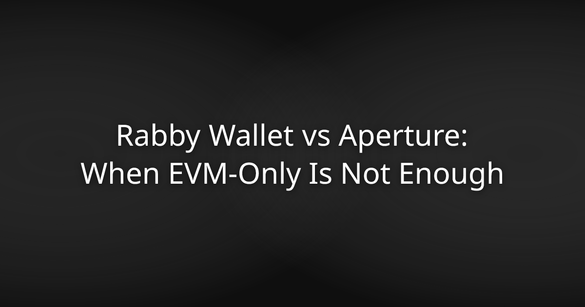

# Rabby Wallet vs Aperture: When EVM-Only Is Not Enough

Rabby Wallet earned its reputation in the EVM community honestly. The pre-transaction simulation feature and chain-switching logic genuinely improved the DeFi experience for Ethereum users. If your entire portfolio lives on EVM chains, Rabby does that job reasonably well.

But a lot of portfolios don't look like that anymore.

Hold Bitcoin, use Solana, or care about what happens to your private keys at the hardware level — and Rabby's architecture stops working for you. That's not a knock on what Rabby set out to build. It's just the reality of what it is: an EVM-only wallet with gaps that matter more in 2026 than they did when it launched.

This comparison is for people who've outgrown those gaps and want a Rabby alternative that doesn't ask them to compromise on chain coverage, key security, or code transparency.

---

## What Rabby Does Well

Rabby's standout feature is pre-transaction simulation. Before you sign anything, it shows you what the transaction will actually do — token approvals, balance changes, contract interactions. For DeFi users who've been burned by malicious approvals, that's genuinely useful.

It also handles multi-chain EVM switching better than MetaMask's default experience, automatically detecting the right network for each transaction.

For pure EVM use, these are real advantages.

---

## Where Rabby Falls Short

### No Bitcoin. No Solana. No Non-EVM Chains.

This is the central limitation. Rabby is EVM-only. Bitcoin and Solana aren't supported, and there's no architectural path to adding them without a fundamental redesign. If you hold BTC or SOL alongside EVM assets, you need a second wallet — which means a split seed phrase setup, two apps to manage, and two separate security surfaces to protect.

### A 3.0 App Store Rating

Rabby holds a 3.0 rating on the App Store as of 2026. That's worth taking seriously. It doesn't mean the product is broken, but it does reflect friction that users encounter often enough to report it consistently.

### No Reproducible Build, No iOS-First Wallet Model

Rabby's mobile app does not ship a reproducible build. You cannot independently verify that the binary you download from the App Store matches the source code. For a wallet handling private keys, that gap matters. If you can't verify the build, you're trusting a process you can't inspect.

Rabby is not built as an iOS-only wallet with local-first app storage and Apple platform integration.

---

## Aperture: Built for the Portfolio Rabby Can't Cover

[Aperture](https://aperturex.io/) is a non-custodial iOS wallet that supports 48 blockchain networks in a single interface — Bitcoin, Ethereum, Solana, and 45+ additional EVM and non-EVM chains. One app, one seed phrase, one interface.

The architecture is built around one principle: your keys never leave your device.

### Local-First Key Storage

When you create a wallet in Aperture, the wallet secret is generated on the device, encrypted locally, and stored in Aperture's GRDB database. It is never transmitted to an Aperture server. This is local encrypted storage, not a Secure Enclave isolation claim.

### Reproducible Builds and Full Open-Source Code

Every line of Aperture's code is public on GitHub at devdasx/aperture, where the repository has 4,200+ stars. The App Store release binary is byte-for-byte reproducible from that source. You can build it yourself and verify the output matches what's in the App Store. That's the math working in your favor — no trust required.

No major multi-chain mobile competitor offers both a fully open-source codebase and a reproducible build. MetaMask's mobile codebase is not fully open-source and ships no reproducible build. Exodus carries partially closed-source components, flagged by Coin Bureau in 2026. Trust Wallet does not ship a reproducible build.

### Zero Accounts, Zero Data Transmitted

Aperture requires no account creation. No email, no username, no onboarding form. You download the app, generate keys, and your wallet exists. Recovery phrases and private keys are encrypted locally so the app can export and sign when the user authorizes it; they are not sent to Aperture servers.

Wallet access can be protected by the app PIN and available device biometrics.

### 48 Networks, One Interface

Where Rabby stops at EVM, Aperture covers 48 networks. Bitcoin and Solana sit alongside your EVM chains in the same interface, under the same seed phrase. Solana Pay is natively integrated. You're not stitching together multiple wallets or juggling multiple recovery phrases.

---

## Side-by-Side Comparison

| Feature | Rabby Wallet | Aperture |
|---|---|---|
| Bitcoin support | No | Yes |
| Solana support | No | Yes |
| EVM chain support | Yes (multi-chain EVM) | Yes |
| Total networks | EVM-only | 48 |
| Local encrypted wallet storage | Limited | Yes |
| Reproducible build | No | Yes |
| Fully open-source | Partially | Yes |
| Account required | No | No |
| Data transmitted to server | Not disclosed | Zero |
| App Store rating (2026) | 3.0 | — |
| Face ID on every action | — | Yes |
| Seed phrase stored server-side | No | No |

---

## Who Should Switch

If your portfolio is entirely EVM and you rely on Rabby's transaction simulation, Rabby still serves that specific use case. The pre-sign preview feature has genuine value for active DeFi users on Ethereum and other EVM chains.

But if any of the following apply, Aperture is the stronger choice:

- You hold Bitcoin or Solana alongside EVM assets
- You want private keys generated in dedicated hardware, not software
- You verify software before trusting it with real assets
- You want one wallet, one seed phrase, and no account setup
- You treat reproducible builds as a baseline requirement, not a bonus

The self-custody principle doesn't change based on which chain your assets live on. Your keys should never leave your device — whether you're on Ethereum, Bitcoin, or Solana.

---

## FAQs

**Can Aperture fully replace Rabby for EVM users?**
Yes. Aperture supports EVM chains alongside Bitcoin, Solana, and 43 additional networks. EVM users get broader chain coverage, local encrypted wallet storage, and a reproducible build that Rabby doesn't offer.

**Does Aperture support the same DeFi interactions as Rabby?**
Aperture connects to DeFi protocols across its supported networks. It does not currently replicate Rabby's pre-transaction simulation feature, but your keys never leave your device and every action requires Face ID authentication.

**Is Aperture safe to use without an account?**
Account creation is architecturally unnecessary. Your wallet secret is generated on your device and encrypted locally; no Aperture server receives it. The codebase is fully open-source and the App Store binary is reproducible from source, so you can verify this independently.

**What happens if I lose my iPhone?**
Your seed phrase is the recovery mechanism. Aperture stores it encrypted locally so it can be revealed/exported after user authorization, and it is not transmitted to Aperture servers. Back it up securely and you can restore your wallet on a new device.

**Does Aperture charge transaction fees?**
Aperture does not add its own fee on top of normal network costs. The only required fee is the blockchain fee paid to the network processing your transaction.

**Is Aperture available on Android?**
No. Aperture is iOS-only. The product is built around Apple platform APIs and a local-first wallet database.

**How do I verify the Aperture build yourself?**
The full codebase is public at devdasx/aperture on GitHub. The repository includes reproducible build instructions. Compile the source and confirm the output matches the App Store binary byte-for-byte.

---

Rabby is a focused tool for a focused use case. If your needs have grown beyond EVM, the same architecture that made it useful in that context becomes the thing holding you back.

Aperture covers 48 networks, keeps wallet secrets encrypted locally, ships a reproducible build, and requires no account. Your keys are not sent to Aperture servers.

[Download Aperture on the App Store at aperturex.io](https://aperturex.io/) — no sign-up required.
